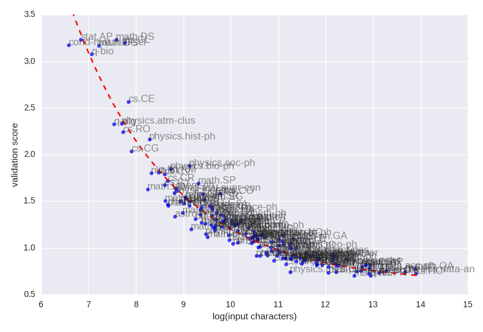

# RNN Science titles
A recurrent neural network with long short term memory to predict titles of scientific articles. Uses karpathy's [char-rnn](https://github.com/karpathy/char-rnn) as the base implementation. 
--------------------------------
I used _every_ title from the [arXiv.org](http://arxiv.org/) to generate models of scientific papers. Each subtopic (over 160!) generated a unique model. 

## Presentation

There is a quick, five-minute [presentation](http://thoppe.github.io/RNN_science_titles/HnT_RNN_arXiv.html) on the project that was given at the DC's Hack && Tell.

## Raw data

The titles used as input and the auto-generated titles can be found in the [/samples](/samples) directory.

## Analysis

Size matters. The most important takeaway is that the log of the raw character count has an almost perfect exponential decay to the quality of the model. From this, we can predict with high confidence the accuracy of a new data will be with this particular set of hyperparameters. Additionally we can see that there is a lower limit of about 0.75, which is independent of the size of the training set.

## Models

Due to space contraints the models are not stored in this repo.

You can recreate these models by using the pre-wrangled input files in the sample directory with the following hyperparameters:

     1024 RNN size
     2 layers
     30 max epochs
     0.5 dropout,
     50 sequence length
     0.002 learning rate
     0.97 decay
     50 batch size

## Instructions

Place all journal titles, new line separated with extension `*.txt` in the [`raw_input`](/raw_input) directory.

Run `python src/wrangle.py` to convert a limited character map (uses unidecode) and copies them into [`input`](/input) directory.

Use `python build_run_script.py` to build scripts to run the torch commands.

